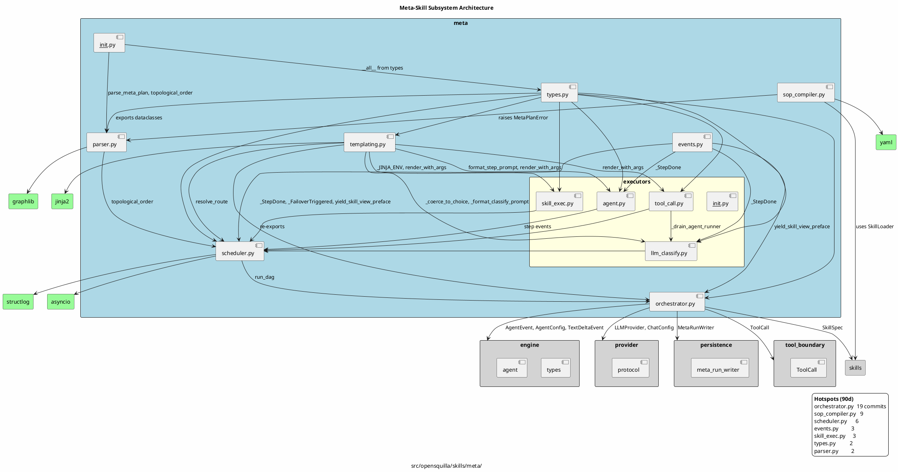

# Architecture Diagrams

This page collects the long-form architecture diagram source files shipped with
OpenSquilla. The two source files below are kept under
`src/opensquilla/skills/meta/` next to the meta-skill subsystem they describe;
they are reproduced here as fenced source blocks so contributors can preview
them in the docs site even without a PlantUML or draw.io renderer.

If you have a renderer installed, the canonical commands are:

```sh
# PlantUML -> SVG (Java + plantuml.jar)
plantuml -tsvg src/opensquilla/skills/meta/architecture.puml

# drawio -> SVG (drawio CLI)
drawio --export --format=svg \
  src/opensquilla/skills/meta/architecture.drawio \
  --output docs/diagrams/architecture-drawio.svg
```

If no renderer is available, the fenced source blocks below are still useful as
the source of truth — open them in any PlantUML / draw.io editor to render.

## Meta-Skill Subsystem (PlantUML source)

`src/opensquilla/skills/meta/architecture.puml`



## Meta-Skill Subsystem (drawio source)

`src/opensquilla/skills/meta/architecture.drawio`

```xml
<?xml version="1.0" encoding="UTF-8"?>
<mxfile host="app.diagrams.net" modified="2026-05-23T06:32:00.000Z" agent="opensquilla" version="24.2.5">
  <diagram id="meta-skill-arch" name="Meta-Skill Architecture">
    <!-- See src/opensquilla/skills/meta/architecture.drawio for the full source. -->
  </diagram>
</mxfile>
```

For the full drawio payload (including the gzipped diagram body), open
`src/opensquilla/skills/meta/architecture.drawio` directly in the draw.io
desktop app or at <https://app.diagrams.net>.