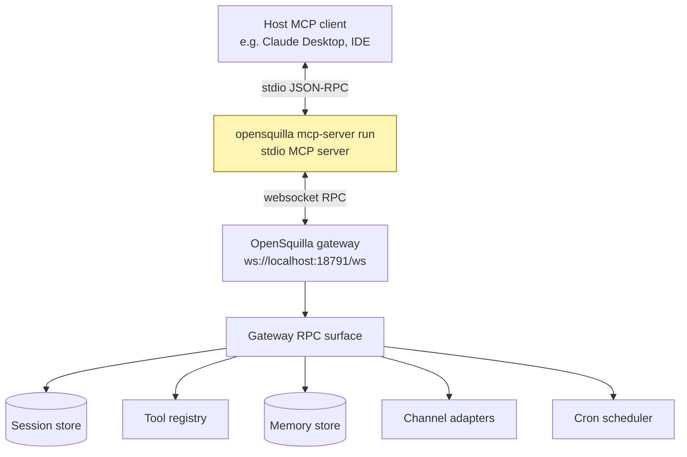

# MCP Server Bridge

OpenSquilla can run as a stdio MCP server bridge for MCP-capable clients. Use
this when another local AI client should call into OpenSquilla session
workflows through the Model Context Protocol.

The MCP bridge is an integration surface. It is separate from OpenSquilla's Web
UI, CLI, channels, and gateway control console.



## Requirements

Install OpenSquilla with the MCP extra when you need this bridge:

```sh
uv tool install --python 3.12 "opensquilla[recommended,mcp] @ https://github.com/opensquilla/opensquilla/releases/download/v0.5.0rc3/opensquilla-0.5.0rc3-py3-none-any.whl"
```

Start the OpenSquilla gateway:

```sh
opensquilla gateway run
```

Or use the managed gateway:

```sh
opensquilla gateway start --json
opensquilla gateway status
```

## Run the Bridge

```sh
opensquilla mcp-server run
```

By default, the bridge connects to:

```text
ws://localhost:18791/ws
```

Use a different gateway:

```sh
opensquilla mcp-server run --gateway ws://localhost:18792/ws
```

The command runs a stdio MCP server. Configure your MCP-capable client to launch
that command as the server process.

## Safety Notes

- Keep the gateway bound to `127.0.0.1` unless you intentionally expose it.
- Do not put provider keys or channel secrets in MCP client config examples.
- Treat the MCP client as another tool-calling surface. The same OpenSquilla
  permissions, tools, sessions, and gateway state still matter.

## Troubleshooting

If the bridge cannot start:

```sh
opensquilla gateway status
opensquilla doctor
```

If the command reports that MCP dependencies are missing, reinstall with the
`mcp` extra.

Read next:

- [`configuration.md`](configuration.md)
- [`tools-and-sandbox.md`](tools-and-sandbox.md)
- [`operations.md`](operations.md)

---

[Docs index](README.md) · [Product guide](../README.product.md) · [Improve this page](contributing-docs.md) · [Report a docs issue](https://github.com/opensquilla/opensquilla/issues/new?template=docs_report.yml)
